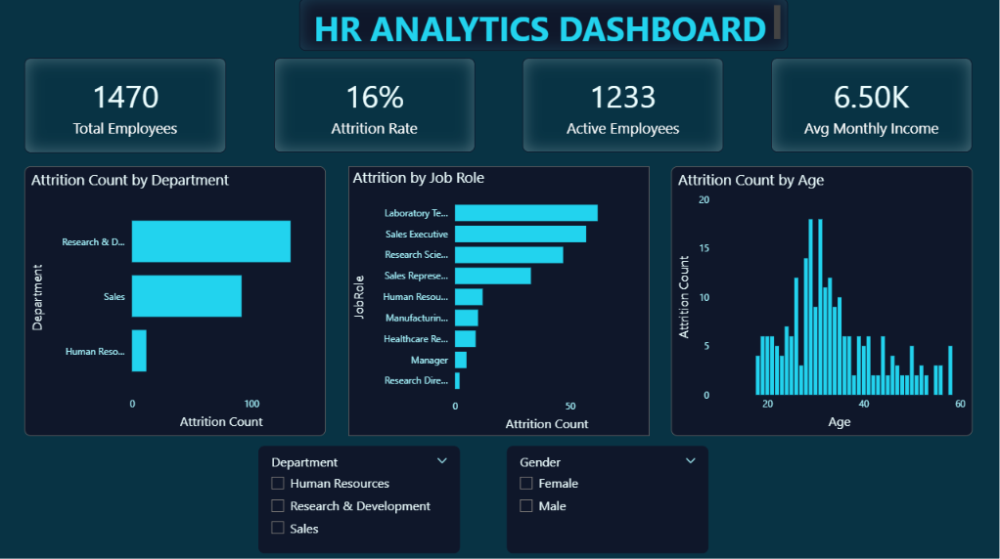
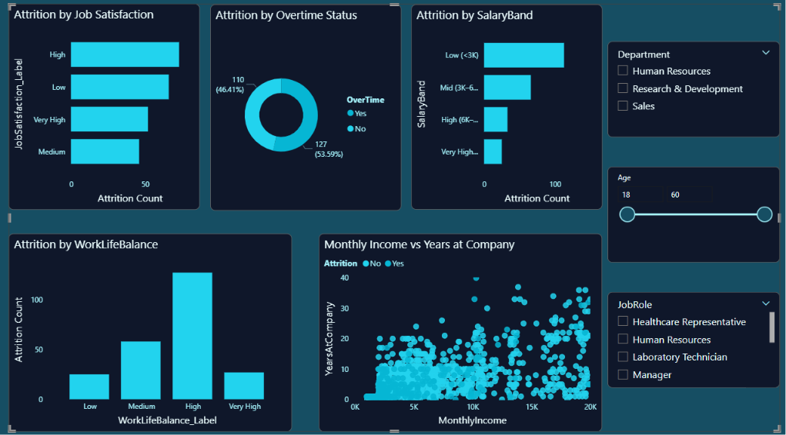
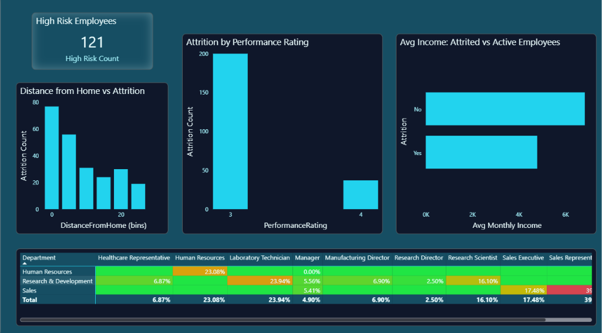

# HR Analytics Dashboard

## Project Overview
Interactive HR Analytics Dashboard built using Power BI.

## Tools Used
- Power BI
- DAX
- Power Query
- Data Modeling

## Dashboard Pages

### Executive Summary
- Total Employees
- Attrition Rate
- Active Employees
- Average Monthly Income

### Employee Deep Dive
- Job Satisfaction Analysis
- Overtime Analysis
- Salary Band Analysis
- Work-Life Balance Analysis

### Workforce Health & Risk
- High Risk Employees
- Performance Rating Analysis
- Distance From Home Analysis
- Attrition Heatmap

## Dashboard Screenshots

### Executive Summary

### Employee Deep Dive

### Workforce Health & Risk

## Author
Karthika V
